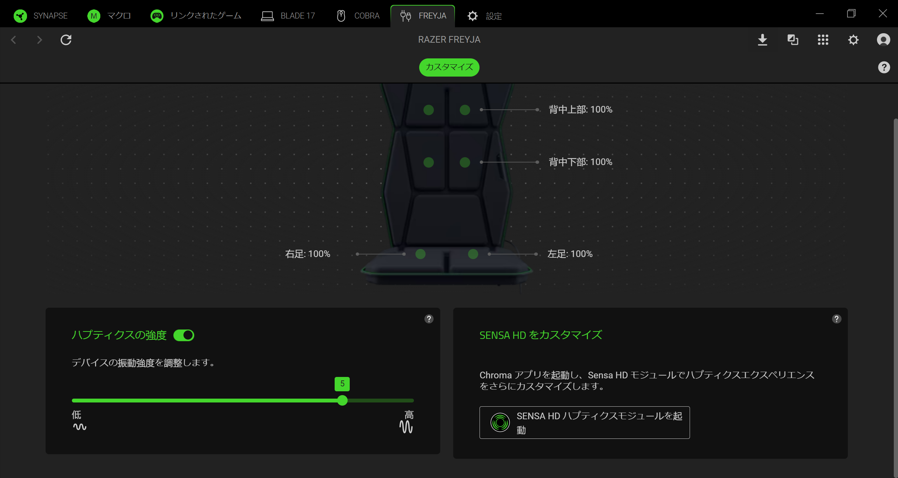
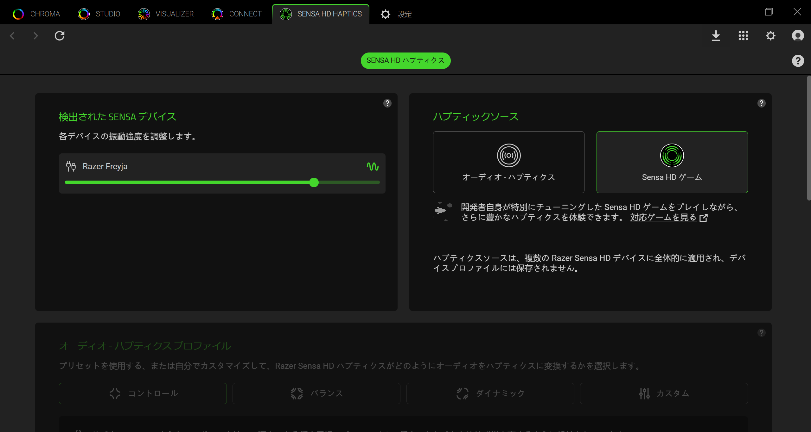
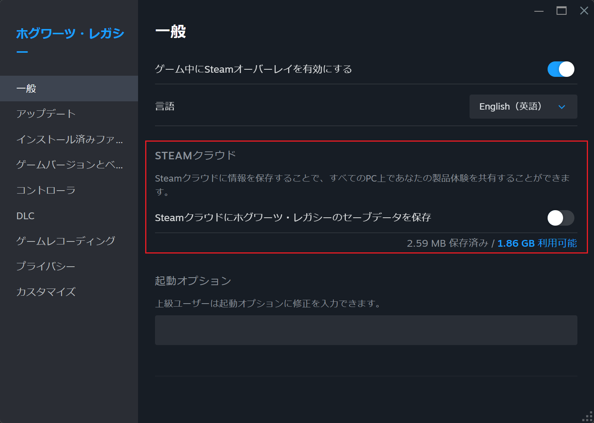

# Razer Sensa DevKit

## 目次
- [Razer Sensa DevKit](#razer-sensa-devkit)
  - [目次](#目次)
  - [1. ドライバーの更新 ](#1-ドライバーの更新-)
    - [1.1. Razer Synapse 4 セットアップ  (場所: Drivers\\Kraken)](#11-razer-synapse-4-セットアップ--場所-driverskraken)
    - [1.2. Razer Freyja セットアップ ](#12-razer-freyja-セットアップ-)
    - [1.3. Razer Wolverine V3 Pro セットアップ ](#13-razer-wolverine-v3-pro-セットアップ-)
  - [2. アプリ ](#2-アプリ-)
    - [2.1 Synesthesia アプリ  (場所: Synesthesia)](#21-synesthesia-アプリ--場所-synesthesia)
    - [2.2. テックデモ  (場所: TechDemo)](#22-テックデモ--場所-techdemo)

---

Razer Sensa DevKit は以下のハードウェアデバイスとソフトウェアスイートで構成されています：

- **ハードウェア:**
  - Razer Kraken v4 Pro（開発キットユニット - ベースステーションなし）
  - Razer Freyja ハプティッククッション（市販品）
  - Razer Wolverine V3 Pro コントローラー（市販品）[在庫状況による]
  - Razer Chroma RGB デバイス（キーボード、マウス、マウスパッド）[在庫状況による]

- **ドライバー/ファームウェア:**
  - Razer Synapse 4

- **デモ:**
  - Hogwarts Legacy PC版
  - Tech Demo

## 1. ドライバーの更新 

### 1.1. Razer Synapse 4 セットアップ  (場所: Drivers\Kraken)

- Synapse 実行ファイルから Razer Synapse 4 セットアップを起動します（場所: `Drivers\Synapse\Synapse 4`）。最新バージョンは以下のリンクからもダウンロード可能です: [https://www.razer.com/synapse-4](https://www.razer.com/synapse-4)
- セットアップ中に Chroma オプションを確認してください。
- セットアップ完了後、Razer ID でサインインするか、新規作成して開始します（またはゲストとしてログイン）。
- 再起動が必要な場合は、PCを再起動してください。
- Razer Synapse 4 を開き、Razer Freyja / Wolverine V3 Pro または Kraken V4 Pro タブに移動し、**Launch Sensa HD Haptics** ボタンを押します。Haptic Source が「Sensa HD Games」であることを確認してください。もし「Audio-to-Haptics」になっている場合は「Sensa HD Games」に切り替えます。

  

### 1.2. Razer Freyja セットアップ 

#### Razer Freyja のセットアップ方法

- 電源プラグをコンセントに差し込み、ケーブルを Razer Freyja ハプティッククッションに接続します。
- 電源ボタンを押して Freyja をオンにします。
- USBドングルをPCに接続します。
- LEDインジケーターが**緑色で点灯**していることを確認してください（接続済みの状態）。

#### ボタンの機能

- **Power:** デバイスの電源ON/OFF。
- **Haptic Intensity:** ハプティック強度を選択（レベル1＝低 ～ レベル6＝高）。
- **Source:** USBドングル（緑）とBluetooth（青、現段階では非対応）を切り替え。
- **重要な注意:**  
  - 緑色が点滅している場合、USBドングルを別のポートに差し替えてください。  
  - 青色（点滅または点灯）の場合、Bluetoothモードになっていますので、Sourceボタンを押してUSB 2.4ドングル接続に切り替えてください。

---

### 1.3. Razer Wolverine V3 Pro セットアップ 

#### Razer Wolverine V3 Pro のファームウェア更新（v2.02以上）

- 以下のリンクから Razer Wolverine V3 Pro Firmware Updater をダウンロードしてください。
  [https://mysupport.razer.com/app/answers/detail/a_id/14630/~/razer-wolverine-v3-pro-firmware-updater-%7C-rz06-0520](https://mysupport.razer.com/app/answers/detail/a_id/14630/~/razer-wolverine-v3-pro-firmware-updater-%7C-rz06-0520)
- 上記リンクの指示に従って、Razer Wolverine V3 Pro コントローラーのファームウェアを更新します。

#### Razer Wolverine V3 Pro のセットアップ方法

- USBドングルまたはUSBケーブルをPCに接続します。
- Xboxボタンを押してコントローラーをオンにします。
- o + Menu + A ボタンを同時に2秒間押してPCモードに切り替えます。Sensa HD HapticsはPCモードのみ対応、Xboxモードでは非対応です。

---

## 2. アプリ 

### 2.1 Synesthesia アプリ  (場所: Synesthesia)

#### 2.1.1 概要

Synesthesia エンジンは、WYVRN対応ゲームを Razer Chroma RGB および Sensa ハプティックデバイスと統合し、ゲーム内イベントに基づいた動的なハプティックフィードバックを提供します。  
DevKitには、Hogwarts Legacy（ホグワーツ・レガシー）のハプティック統合例が含まれています。  
Synesthesia の完全なドキュメントはこちら:  
[https://doc.wyvrn.com/docs/wyvrn-sdk/wyvrn-configuration/haptics/](https://doc.wyvrn.com/docs/wyvrn-sdk/wyvrn-configuration/haptics/)

Synesthesia アプリは `ReleaseConsole` フォルダーにあります。コンソール版はテストおよびQA目的で提供されています。`HapticFolders` は Synesthesia アプリフォルダ内にあり、最新バージョンは以下にあります: `C:\Program Files (x86)\Interhaptics\HapticFolders`（Razer Chromaインストール済み前提）

本番版 Synesthesia の代わりにコンソール版（Synapse/Chroma 4 にHapticService バックグラウンドサービスとして含まれる）を使用するには、以下の手順に従ってください。

- Razer Synapse 4 を開き、Razer Freyja/Kraken V4 Pro タブで **Launch Sensa HD Haptics** ボタンを押します。  
  Haptic Source が「Sensa HD Games」であることを確認してください。  
  もし「Audio-to-Haptics」になっている場合は「Sensa HD Games」に切り替えます。
  

- タスクマネージャーを開き、**Haptic Service**のバックグラウンドプロセスが動作しているか確認し、動作中なら終了します。

- Synesthesia アプリを開き（ダウンロードはこちら：[https://github.com/Interhaptics/RazerSensa_DevKit](https://github.com/Interhaptics/RazerSensa_DevKit)）、WYVRNFakeClientでUIに表示される`load; active; play`などのコマンドをテストします。
- **トラブルシューティング:** イベントが表示されない場合、コンソールで Enter を押して再起動してください（未送信イベントのバッファを解放します）。この問題はコンソール版のみ、HapticServiceコンポーネントでは発生しません。

#### 2.1.2 Chroma Sensa対応ゲームでハプティックをテスト（例: Hogwarts Legacy / Marvel Rivals）

以下の手順は Hogwarts Legacy（ホグワーツ・レガシー）用ですが、次のリンク[https://www.razer.com/chroma-workshop#--sensa-games](https://www.razer.com/chroma-workshop#--sensa-games)に掲載されているいずれのゲームにも適用可能です。（例：Marvel Rivals／マーベル・ライバルズ、Final Fantasy XVI／ファイナルファンタジー16、Silent Hill 2／サイレントヒル2、Sniper Elite: Resistance／スナイパーエリート：レジスタンス、Frostpunk 2／フロスパンク２、Symphonia／シンフォニア など）

- PC版（Steam/Epic）の Hogwarts Legacy をインストール。
- Razer Sensa ハプティックデバイスを接続。
- Hogwarts Legacy / Marvel Rivals が Chroma App として有効になっていることを確認。
- Razer Synapse 4 を開き、Razer Freyja/Kraken V4 Pro タブで **Launch Sensa HD Haptics** ボタンを押します。  
- Haptic Source が「Sensa HD Games」であることを確認してください。  
  もし「Audio-to-Haptics」になっている場合は「Sensa HD Games」に切り替えます。
  

- Hogwarts Legacy または Marvel Rivals を起動。

*カスタムハプティックフォルダーを追加するには、Synesthesiaアプリの `HapticFolders` 内にフォルダーをコピーし、ゲームを起動してください。下の画像には、ゲーム中に Synesthesia コンソールアプリ内で表示される Hogwarts Legacy の呼び出し例が含まれています。

ハプティックはすべてのゲームイベントに実装済みです。Hogwarts Legacy をプレイしていない場合、以下の手順でセーブファイルを導入してください:
- Steam/Epic アカウントからゲームを起動し、Hogwartsの手紙が表示されたら終了。
- Steam Cloud を無効化（右クリックで設定）。  

- ファイルエクスプローラーで次の場所に移動します
`C:\Users\<Your USERNAME>\AppData\Local\Hogwarts Legacy\Saved\SaveGames`
- その場所にあるすべてのフォルダーを複製します（フォルダー名は数字でラベル付けされているはずです）。
- 元のフォルダーの内容を削除し、空になったフォルダーに `HogwartsLegacySaveGame.zip` を解凍します。

### 2.2. テックデモ  (場所: TechDemo)

- Synesthesia コンソールを閉じる。
- `TechDemo_V[x.x.x].zip` を任意のフォルダに解凍。
- 解凍したフォルダ内から TechDemo アプリを起動。
- Play を押して Razer Sensa Tech Demo を体験。

[目次に戻る](#table-of-contents)
