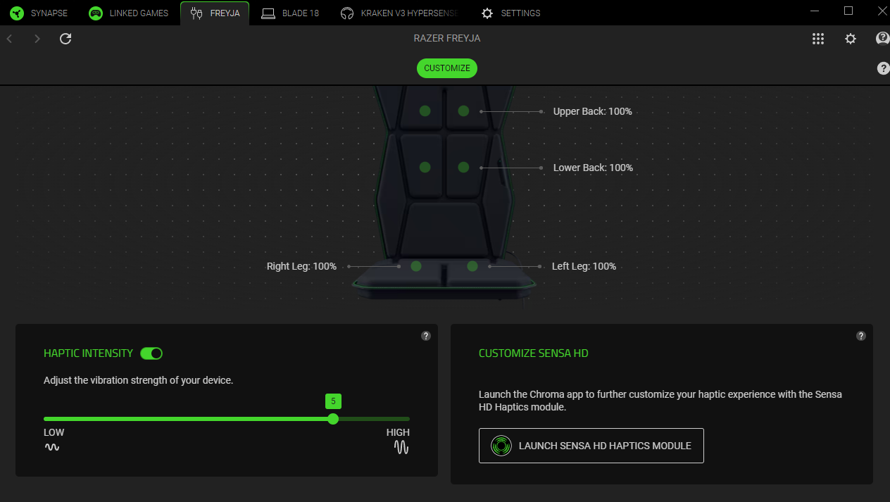
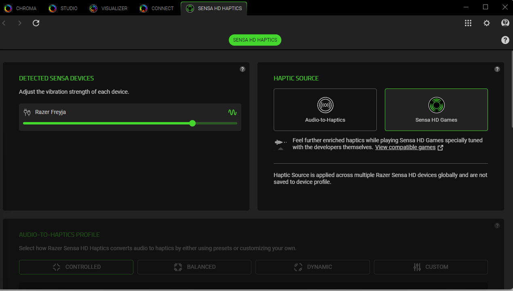
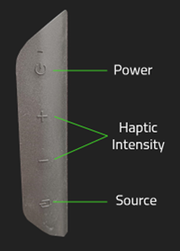
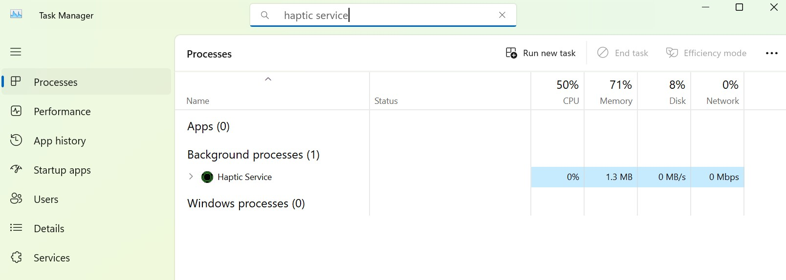
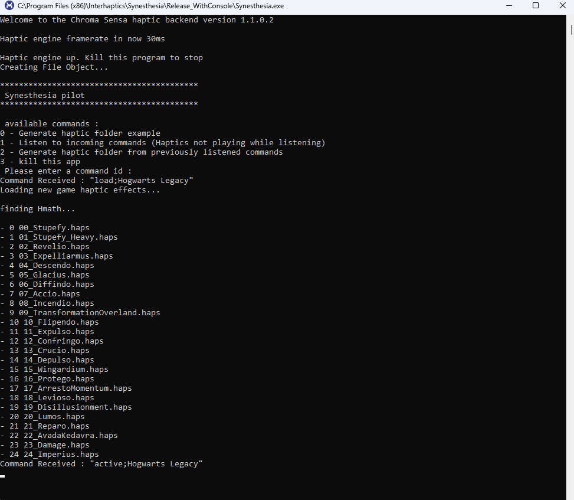
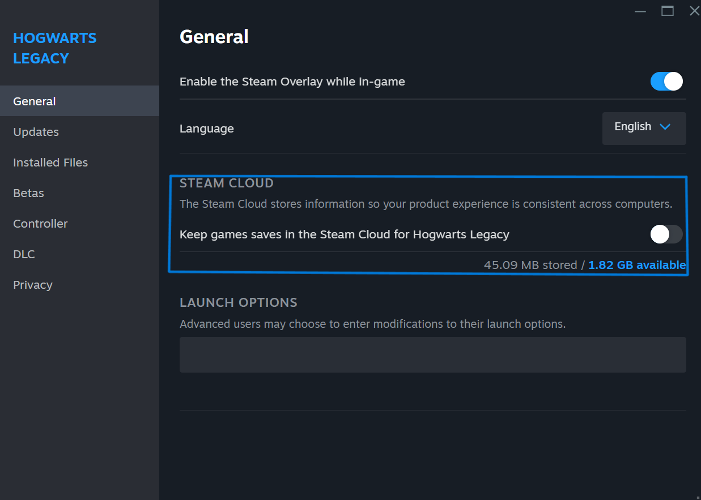
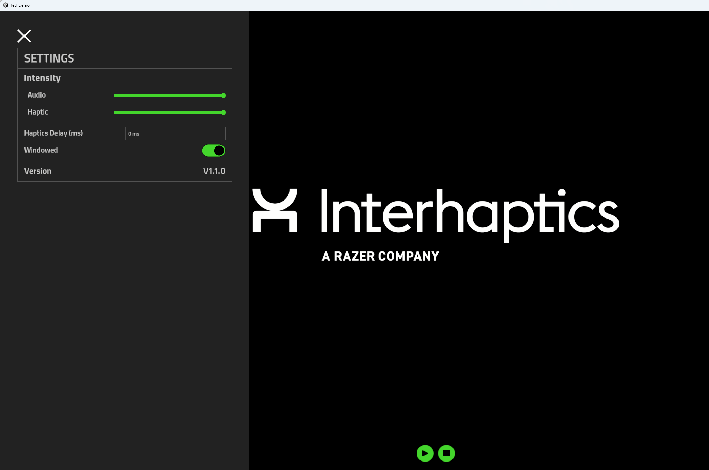

## Table of Contents
1. [Drivers Update](#drivers-update)
    1. [Razer Synapse 4 Setup](#razer-synapse)
    2. [Razer Freyja Setup](#esther-device-setup)
    3. [Razer Wolverine V3 Pro Setup](#wolverine-device-setup)
2. [Apps](#apps)
    1. [Synesthesia App - Hogwarts Legacy / Marvel Rivals](#synesthesia-app)
    2. [Tech Demo](#tech-demo) 

---

The Razer Sensa DevKit consists of the following hardware devices and software suite:
- Hardware:
  - Razer Kishi Ultra game controller (retail unit)
  - Razer Kraken v3 Hypersense headphones (retail unit; needs a firmware update) / Kraken v4 Pro (retail unit) [based on availability]
  - Razer Freyja haptic cushion (retail unit)
  - Razer Wolverine V3 Pro controller (retail unit) [based on availability]
- Drivers/Firmware:
	- Razer Synapse 4
	- Razer Sensa device drivers
	- Razer Kraken v3 Hypersense custom firmware
- Demos
  - Hogwarts Legacy PC Version
  - Tech Demo

## 1. Drivers Update 

### 1.1. Razer Synapse 4 Setup  (Location: Drivers\Kraken)

- Launch the Razer Synapse 4 setup from the Synapse executable (Location: Drivers\Synapse\Synapse 4). The latest version can also be downloaded from this link: https://www.razer.com/synapse-4
- Check the Chroma options during setup.
- After the setup is finished sign in with your Razer Id or create one to get started (or log in as a Guest). 
- If a reboot is required, restart your PC.
- Open Razer Synapse 4. Go to the Razer Freyja/Wolverine V3 Pro or Kraken V4 Pro tab and press the Launch Sensa HD Haptics Button. Check that Haptic Source is Sensa HD Games. If it is Audio-to-Haptics switch it to Sensa HD Games.

### 1.2. Razer Freyja Setup 

#### How to setup Razer Freyja

- Put the electrical plug into the socket and attach the cable to the Razer Freyja haptic cushion.
- Turn on Esther by pushing the power button.
- Plug the USB dongle into your PC.
- LED indicator must be solid green to be connected

#### Button functionalities

- **Power:** Turn ON/OFF the device.
- **Haptic Intensity:** Select general haptic intensity of the device. From level 1 (low) to level 6 (high).
- **Source:** Select between USB dongle (Green) and Bluetooth (Blue, not supported at the current stage).
- **Important Note:** If the light is blinking green, plug the USB dongle in another port. If the light is blue (blinking or solid) that means that the device is in BLuetooth mode and it should be changed by pressing the Source button to the USB 2.4 dongle connection.

### 1.3. Razer Wolverine V3 Pro Setup 

#### Firmware Update for Razer Wolverine V3 Pro

 - Download the Razer Wolverine V3 Pro Firmware Updater from this link: https://mysupport.razer.com/app/answers/detail/a_id/14630/~/razer-wolverine-v3-pro-firmware-updater-%7C-rz06-0520 
 - Follow the instructions from the link above to update the firmware of the Razer Wolverine V3 Pro controller.

#### How to setup Razer Wolverine V3 Pro

- Plug the USB dongle or USB cable into your PC.
- Turn on the controller by pushing the Xbox button.
- Press o + Menu + A button simultaneously for 2 seconds to enter PC mode. Sensa HD Haptics are supported only in PC mode, not in Xbox mode.
- 

## 2. Apps 

### 2.1 Synesthesia App  (Location: Synesthesia)

##### 2.1.1 Overview

The Synesthesia engine integrates the WYVRN enabled games with various Razer Chroma RGB and Sensa haptic devices to provide a synchronized gaming experience that involves dynamic haptic feedback based on in-game events. The DevKit contains an example of the Hogwarts Legacy haptic integration. A complete documentation on Synesthesia can be found at this link: [https://doc.wyvrn.com/docs/wyvrn-sdk/wyvrn-configuration/haptics/](https://doc.wyvrn.com/docs/wyvrn-sdk/wyvrn-configuration/haptics/)

The Synesthesia apps can be found in the folder `ReleaseConsole`. The engine is shipped in Synapse 4 when Esther and Kraken V4 Pro will launch. The console version is provided for testing and QA purposes. THe Haptic folders can also be found in the Synesthesia app folder under `HapticFolders`.  

To use the console version instead of the production version of Synesthesia (included in Synapse 4) follow the steps below.

- Open Razer Synapse 4. Go to the Razer Freyja/Kraken V4 Pro tab and press the Launch Sensa HD Haptics Button. Check that Haptic Source is Sensa HD Games. If it is Audio-to-Haptics switch it to Sensa HD Games.

- Open Task Manager. Look for the Haptic Service background process and check if it is active. Restart it if it is not active.

- Open the Synesthesia app downloaded from https://github.com/Interhaptics/RazerSensa_DevKit and test the setup with ChromaFakeClient and the following commands load; active; play which will appear when starting the app. 

##### 2.1.2 Test Haptics with Chroma Sensa integrated games (Case: Hogwarts Legacy / Marvel Rivals)

The following instructions are for the Hogwarts Legacy game, but can be applied to any game from the following link - https://www.razer.com/chroma-workshop#--sensa-games (ex: Marvel Rivals, Final Fantasy XVI, Silent Hill 2, Sniper Elite: Resistance, Frostpunk 2, Symphonia etc)/Marvel Rivals. 
- Install the PC (Steam/Epic) version of Hogwarts Legacy.
- Plug in the Razer Sensa haptic devices.
- Check that Hogwarts Legacy/Marvel Rivals are switched on as Chroma App. 
- Open Razer Synapse 4. Go to the Razer Freyja/Kraken V4 Pro tab and press the Launch Sensa HD Haptics Button. Check that Haptic Source is Sensa HD Games. If it is Audio-to-Haptics switch it to Sensa HD Games.

- Launch the Hogwarts Legacy or Marvel Rivals.

*If you want to see the haptic effects played or want to add a custom haptic folder (in case on a QA process skip the previous folder and just follow the 2.1.1 steps. After this copy the custom haptic folder inside the Synesthesia app HapticFolders and launch the game - image below contains the Hogwarts Legacy calls example as they appear during the game inside the Synesthesia console app)

**Haptics is implemented on all the game events. If you have not played Hogwarts Legacy, install this save file through this quick guide:
- Start up the game from your Steam/Epic account. Once it shows the Hogwarts letter, exit the game.
- Disable Steam Cloud for the save games of Hogwarts Legacy. Right-click on Hogwarts Legacy (see image below).

- In your file explorer go to `C:\Users\<Your USERNAME>\AppData\Local\Hogwarts Legacy\Saved\SaveGames`
- Make duplicates of all the folders at that location (should be labeled with numbers). 
- Delete the content of the original folder. Unpack HogwartsLegacySaveGame.zip in the now empty folder.

### 2.2. Tech Demo  (Location: TechDemo)
- Close Synesthesia Console
- Decompress the file TechDemo_V[x.x.x].zip in a folder of your choice.
- Launch the TechDemo app from inside the unarchived folder.
- Press Play and enjoy the Razer Sensa Tech Demo.

[Back to Table of Contents](#table-of-contents)
