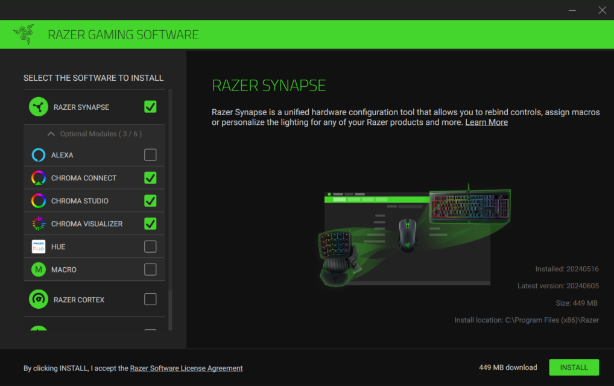
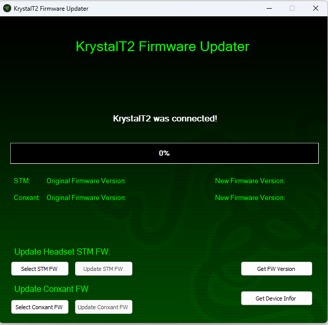
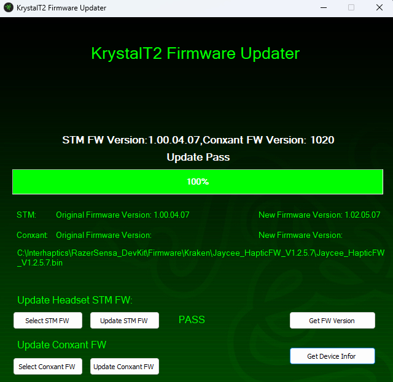
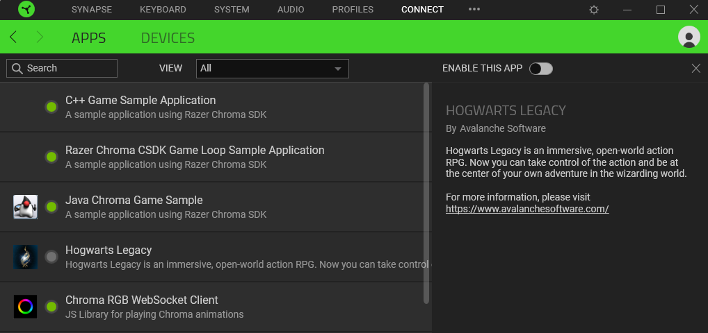

## Table of Contents
1. [Drivers Update](#drivers-update)
    1. [Razer Synapse 3 Setup](#razer-synapse)
    2. [Razer Kraken Firmware Update](#kraken-firmware-update)
    3. [Razer Sensa Devices Libraries](#razer-sensa-devices-libraries)
    4. [Esther Device Setup](#esther-device-setup)
2. [Apps](#apps)
    1. [Synesthesia App - Hogwarts Legacy](#synesthesia-app)
    2. [Tech Demo](#tech-demo) 
    3. [Mech Warrior 5 Mod](#mech-warrior-5-mod)

---

The Razer Sensa DevKit consists of the following hardware devices and software suite:
- Hardware:
  - Razer Kishi Ultra game controller (retail unit)
  - Razer Kraken headphones (retail unit; needs a firmware update)
  - Razer Esther (pre-production unit)
- Drivers/Firmware:
	- Razer Synapse 3
	- Razer Sensa device drivers
	- Razer Kraken custom firmware
 - Demos
  - Hogwarts Legacy PC Version
  - Tech Demo
  - Mech Warrior 5 Mod 
  

## 1. Drivers Update 

### 1.1. Razer Synapse 3 Setup  (Location: Drivers\Kraken)

- Launch the Razer Synapse 3 setup from the Synapse executable (Location: Drivers\Synapse). The latest version can also be downloaded from this link: https://www.razer.com/synapse-3
- Check the Chroma options during setup.
- After the setup is finished sign in with your Razer Id or create one to get started. The Razer haptic devices will be automatically recognized by the Razer Synapse app.
- If a reboot is required, restart your PC.

### 1.2. Kraken Firmware Update  (Location: Drivers\Kraken)

- Plug the Razer Kraken Hypersense device into a USB port of your PC.
- Open the folder `Drivers\Kristal - FactoryFWUKrystalT2STM32_v1.02.03_20211111`. Launch the executable `FactoryFWUKrystalT2STM32.exe`.
- Click on the `Select STM FW` button. A file input popup should appear for bin file.
- Select the Firmware `Jaycee_HapticFW_V1.2.5.9` bin file and open it. The software window should update itself to display the selected file path.
- Click on the `Update STM FW` button. Wait until the loading bar indicates 100%.
- You can close the software, your device firmware is now updated.

### 1.3. Razer Sensa devices libraries  (Location: Drivers)

- Launch `Install_RzInterHaptics_Inbox_1.x.x.x.exe` to install the Razer Sensa device libraries. [1.x.x.x - current version of drivers]

### 1.4. Esther Device Setup 

#### How to setup Esther

- Put the electrical plug into the socket and attach the cable to Esther.
- Turn on Esther by pushing the power button.
- Plug the USB dongle into your PC. (Avoid USB hubs)

#### Button functionalities

- **Power:** Turn ON/OFF the device.
- **Haptic Intensity:** Select general haptic intensity of the device. From level 1 (low) to level 6 (high).
- **Source:** Select between USB dongle (default) and Bluetooth (not supported at the current stage).
- **Important Note:** Connection light should be solid green. If the light is blinking green, change the USB dongle location and restart the device. If the light is blue (blinking or solid) that means that the device is in BLuetooth mode and it should be changed by pressing the Source button to the USB 2.4 dongle connection. 

## 2. Apps 

### 2.1 Synesthesia App  (Location: Synesthesia)

##### 2.1.1 Overview

The Synesthesia modding tool integrates the Chroma DLL enabled games with various Razer Sensa haptic devices to provide a synchronized gaming experience that involves dynamic haptic feedback based on in-game events (Chroma animations). The DevKit contains an example of the Hogwarts Legacy haptic integration. A complete documentation on Synesthesia can be found at this link: https://www.interhaptics.com/doc/chroma-sensa/#synesthesia 

The Synesthesia apps can be found in the folders `Release`, and `ReleaseConsole`.

- `Release\`: folder containing release candidate version of Synesthesia (no window/background process)
- `ReleasewithConsole\`: folder containing console version of Synesthesia. This version is able to automatically create a Haptic Folder just by listening to a Chroma Sensa enabled app’s external messages.

##### 2.1. Example: Hogwarts Legacy

- Install the Steam version of Hogwarts Legacy.
- Plug in the Razer Sensa haptic devices.
- Open Synapse and uncheck `ENABLE THIS APP` from the `CONNECT'->'APPS' section.

- Launch the Synesthesia app from the Synesthesia/ReleaseConsole folder (as Administrator). The Hogwarts Legacy haptic files are already inside the package and will intercept the Chroma Events sent by the game to play the corresponding haptics. The following messages can be seen on the Synesthesia with Console app.

- Launch the Hogwarts Legacy game.
- Stupefy!

### 2.2. Tech Demo  (Location: TechDemo)
- Stop Synesthesia if it is already running. (If Synesthesia.exe was opened before, use the SynesthesiaStop.exe. If running SynesthesiaConsole, close it.)
- Decompress the file TechDemo_V[x.x.x].zip in a folder of your choice.
- Plug the custom firmware Kraken and the Kishi Ultra game controller in USB ports. For the Kraken check that the haptics button situated on the bottom right cup is on and at the right intensity for you (it has an off sound and 3 possible intensities from low to high).
- Launch the TechDemo app from inside the unarchived folder.
- Before pressing play, you can set the intensity of Haptics, Audio, or add a haptic delay.
- Press Play and enjoy the Razer Sensa Tech Demo.

### 2.3. Mech Warrior 5 Mod  (Location: MechWarrior5)

- Copy the folder `RzInterhaptics` from `MechWarrior5\HapticEngine\V2.0.1` to `C:\Program Files (x86)\Interhaptics\` (contains Clipboard Haptic Engine and custom haptic effects).
- Copy the contents of `MechWarrior5` to `C:\Program Files\Epic Games\MW5Mercs\MW5Mercs\Mods`. If the `Mods` folder does not exist, you must create it. A complete guide with pictures can be found inside the `MechWarrior5` folder: `Mod_setup.pdf`.
- Run ProtoComUnreal.exe from RzInterhaptics\x64\Release.

[Back to Table of Contents](#table-of-contents)
