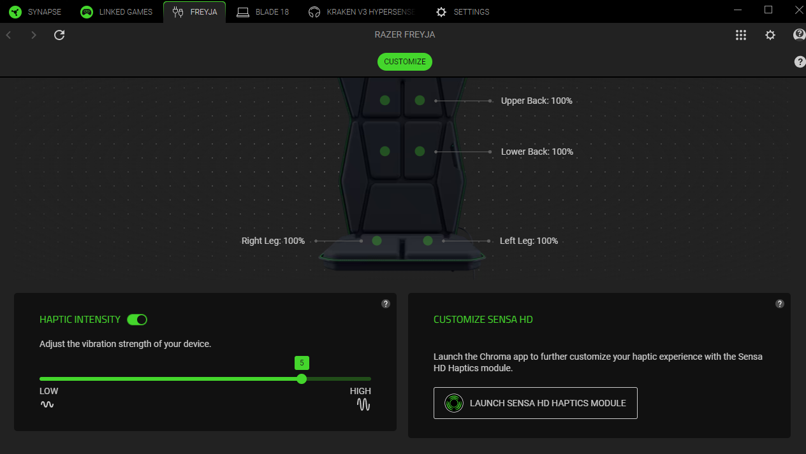
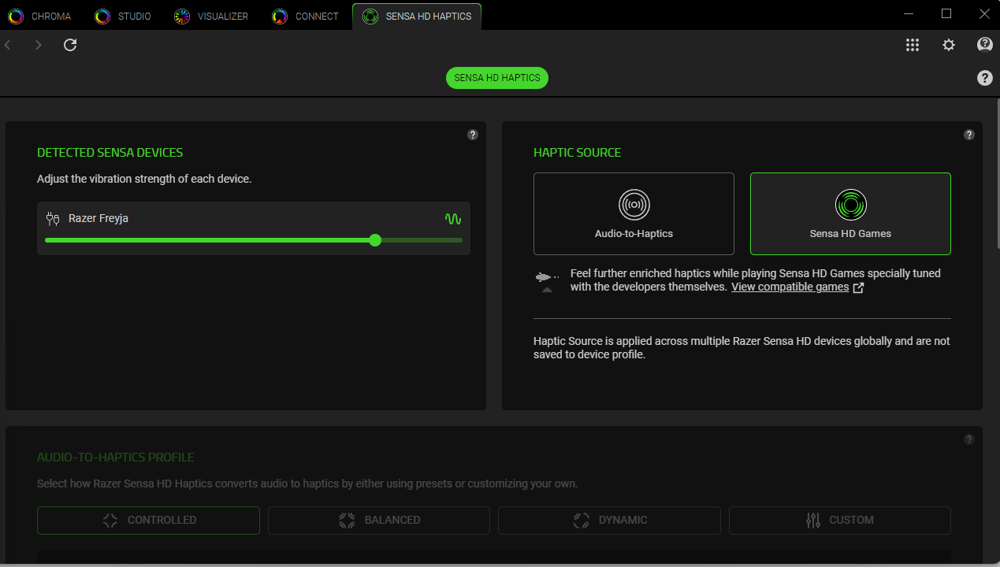
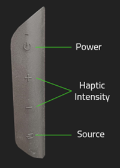
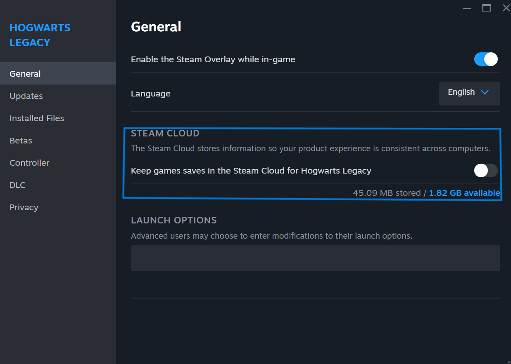
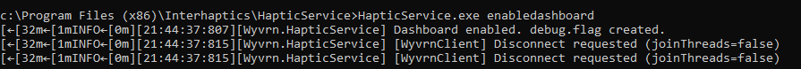
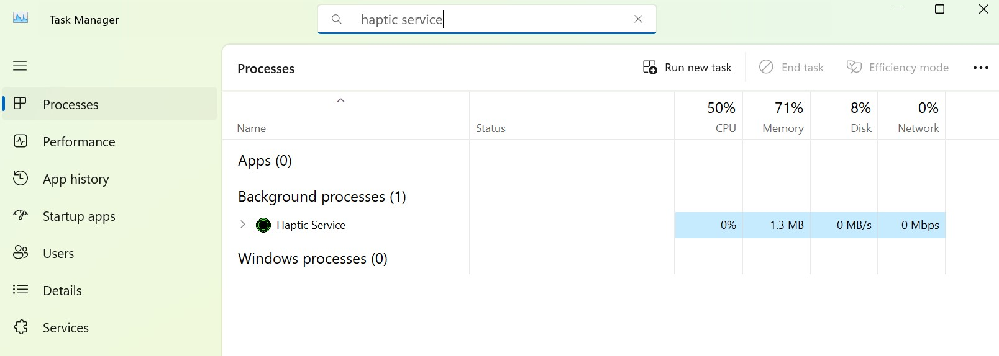
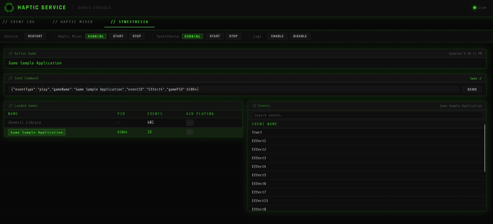
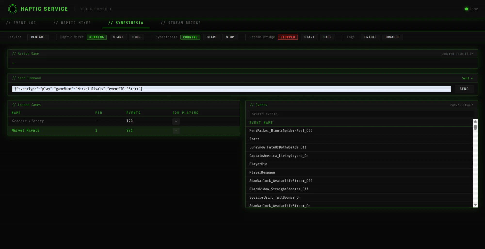
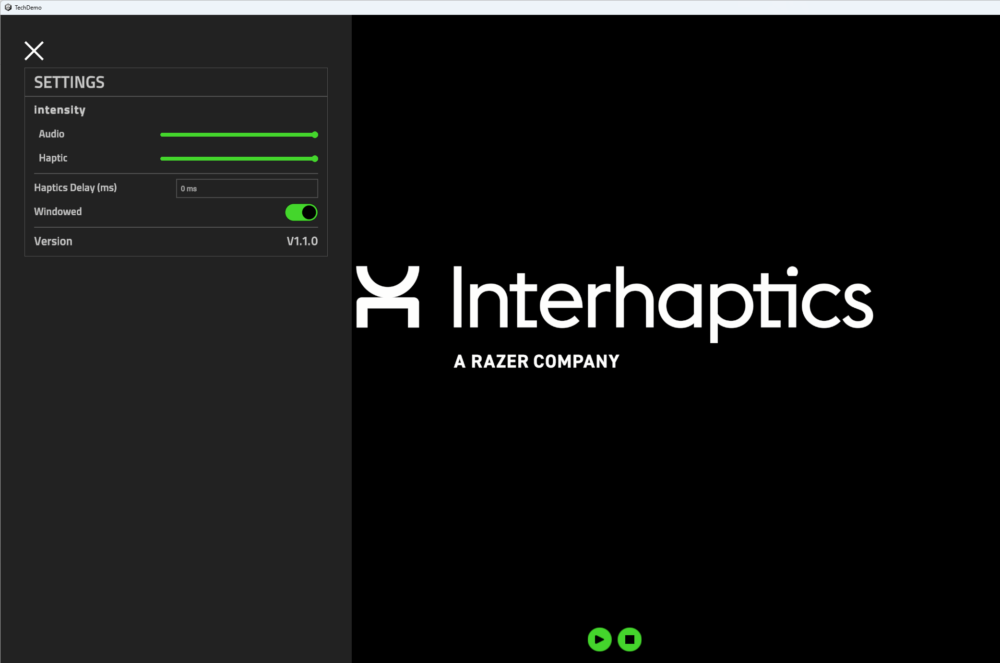

# Razer Sensa DevKit

The Razer Sensa DevKit lets you integrate and test Sensa HD Haptics in your game through the WYVRN SDK.

## Table of Contents
1. [Kit Contents](#kit-contents)
2. [Hardware and Driver Setup](#hardware-and-driver-setup)
    1. [Razer Synapse 4](#razer-synapse-4)
    2. [Razer Freyja](#razer-freyja)
    3. [Razer Wolverine V3 Pro](#razer-wolverine-v3-pro)
3. [WYVRN SDK Integration](#wyvrn-sdk-integration)
    1. [How It Works](#how-it-works)
    2. [Haptic Folder Deployment](#haptic-folder-deployment)
    3. [Sample and Reference Content](#sample-and-reference-content)
    4. [Testing In-Game](#testing-in-game)
4. [Showcase Games (Hogwarts Legacy / Marvel Rivals)](#showcase-games)
5. [Haptic Service Dashboard (Debugging)](#haptic-service-dashboard-debugging)
6. [Tech Demo](#tech-demo)

---

## Kit Contents

- Hardware:
  - Razer Kraken V4 Pro (devkit unit, no base station)
  - Razer Freyja haptic cushion (retail unit)
  - Razer Wolverine V3 Pro controller (retail unit) [based on availability]
  - Razer Chroma RGB devices (keyboard, mouse, mousepad) [based on availability]
- Drivers: Razer Synapse 4 (`Drivers/`)
- Content:
  - `Apps/Synesthesia/HapticFolders`: example and reference haptic folders (see [Sample and Reference Content](#sample-and-reference-content))
  - `Apps/TechDemo`: Sensa tech demo

## Hardware and Driver Setup

### Razer Synapse 4

1. Run the Synapse 4 installer (`Drivers/RazerSynapseInstaller.exe`). The latest version is also available at https://www.razer.com/synapse-4.
2. Check the **Chroma** options during setup. Chroma is required: the WYVRN SDK and the haptic service are installed with it.
3. Sign in with your Razer ID, create one, or continue as Guest. Reboot if prompted.
4. Open Synapse 4, go to the **Razer Freyja / Wolverine V3 Pro** or **Kraken V4 Pro** tab and press **Launch Sensa HD Haptics**.
5. Make sure **Haptic Source** is **Sensa HD Games**. If it is *Audio-to-Haptics*, switch it.




### Razer Freyja

- Plug in the power supply and attach the cable to the Freyja.
- Press the power button to turn it on.
- Plug the USB dongle into your PC. The LED must be **solid green** when connected.



| Button | Function |
|---|---|
| Power | Turn the device on/off. |
| Haptic Intensity | General intensity, level 1 (low) to 6 (high). |
| Source | USB dongle (green) or Bluetooth (blue, not supported at this stage). |

If the light blinks green, move the dongle to another USB port. If it is blue (blinking or solid) the device is in Bluetooth mode. Press **Source** to switch back to the 2.4 GHz USB dongle.

### Razer Wolverine V3 Pro

1. Update the firmware to **v2.02 or higher** using the [Razer Wolverine V3 Pro Firmware Updater](https://mysupport.razer.com/app/answers/detail/a_id/14630/~/razer-wolverine-v3-pro-firmware-updater-%7C-rz06-0520).
2. Plug in the USB dongle or cable and turn the controller on with the Xbox button.
3. Hold **o + Menu + A** for 2 seconds to enter **PC mode**. Sensa HD Haptics only work in PC mode, not Xbox mode.

## WYVRN SDK Integration

Full SDK and configuration documentation: https://doc.wyvrn.com/docs/wyvrn-sdk/wyvrn-configuration/haptics/

### How It Works

Your game does not stream haptic data. It signals **events** through the WYVRN SDK, and the Haptic Service plays the matching effect on the connected Sensa devices according to a per-game configuration:

1. The game registers as a Chroma app and sends event names through the WYVRN SDK (`CoreSetEventName`).
2. The Haptic Service looks the event up in the game's `Wyvrn.config`.
3. The config maps the event to one or more haptic effect files (`.haps`) and a target body group, and the service renders them on the devices.

Things to keep in mind:

- **Chroma app state:** the game must be switched on in the Chroma Apps list in Synapse. Only one app drives Chroma and haptics at a time (the one at the top of the list).
- **Body groups:** target groups explicitly instead of using "all". Chest / Waist / Hand / Leg cover Freyja and controllers; Head covers the Kraken.
- **Update rate:** haptic output is quantized to about 33 ms (30 fps). Sending events at a finer rate has no effect.
- **Audio-to-Haptics:** the source must be **Sensa HD Games** (see [Synapse setup](#razer-synapse-4)).

### Haptic Folder Deployment

Each game has a folder named after its app title that contains its `Wyvrn.config` and `.haps` files. The service reads them from:

```
C:\Program Files (x86)\Interhaptics\HapticFolders\<App Title>\
```

Copy your folder there. No separate registration step is needed. After changing files, restart the Haptic Mixer (or the service) from the [dashboard](#haptic-service-dashboard-debugging) so the changes are picked up.

### Sample and Reference Content

`Apps/Synesthesia/HapticFolders` holds the haptic folders shipped with Chroma, useful as templates:

- **Game Sample Application:** minimal reference config for WYVRN developers. Start here.
- **GenericEvent:** a library of 120 ready-made events (`@Pistol`, `@Jump`, `@DamageNormal`, `@Engine_Start`, and more) that any game can use without authoring its own effects. See `GenericEvent/Readme.md` for the full list by category.
- Shipping game folders (Hogwarts Legacy, Marvel Rivals, Borderlands 4, and others) to see how real titles map events to effects.

Current versions are in `C:\Program Files (x86)\Interhaptics\HapticFolders` whenever Razer Chroma is installed.

### Testing In-Game

1. Plug in the Sensa devices and complete the [Synapse setup](#razer-synapse-4).
2. Enable your game in the Chroma Apps list.
3. Deploy its haptic folder as described above.
4. Launch the game and trigger the events.
5. Use the [Haptic Service Dashboard](#haptic-service-dashboard-debugging) to confirm that events arrive, effects play and the devices are detected.

For ready-made reference games, see [Showcase Games](#showcase-games).

## Showcase Games (Hogwarts Legacy / Marvel Rivals) <a name="showcase-games"></a>

Test Sensa haptics with Chroma Sensa integrated games. The steps below use Hogwarts Legacy but apply to any game on the list at https://www.razer.com/chroma-workshop#--sensa-games (for example Marvel Rivals, Final Fantasy XVI, Silent Hill 2, Sniper Elite: Resistance, Frostpunk 2, Symphonia).

1. Install the PC (Steam/Epic) version of the game.
2. Plug in the Razer Sensa haptic devices.
3. Check that the game is switched on as a Chroma App.
4. Open Razer Synapse 4, go to the Razer Freyja / Kraken V4 Pro tab, press **Launch Sensa HD Haptics** and check that **Haptic Source** is **Sensa HD Games** (not Audio-to-Haptics).


5. Launch the game.

To watch the haptic events as they are played, enable the [Haptic Service Dashboard](#haptic-service-dashboard-debugging) and keep the **Event Log** and **Events** tabs open while you play. To try a custom haptic folder, copy it to `C:\Program Files (x86)\Interhaptics\HapticFolders\<App Title>\` (see [Haptic Folder Deployment](#haptic-folder-deployment)) and restart the Haptic Mixer from the dashboard before launching the game.

### Hogwarts Legacy save file

Haptics are implemented on all of the game's events. If you have not played Hogwarts Legacy, install the provided save file (`Apps/Synesthesia/HogwartsLegacySaveGame.zip` in the repo):

1. Start the game from your Steam/Epic account. Once it shows the Hogwarts letter, exit the game.
2. Disable Steam Cloud for the Hogwarts Legacy save games: right-click the game in Steam (see image below).



3. In File Explorer go to `C:\Users\<Your USERNAME>\AppData\Local\Hogwarts Legacy\Saved\SaveGames`.
4. Duplicate all the folders at that location (labeled with numbers) as a backup.
5. Delete the content of the original folder, then unpack `HogwartsLegacySaveGame.zip` into the now empty folder.

## Haptic Service Dashboard (Debugging)

The Haptic Service Dashboard is a built-in local web interface for monitoring and controlling the Haptic Service at runtime. It shows which programs are producing haptic output, which devices are connected, lets you adjust volumes, trigger events manually, and watch service logs live.

> **Diagnostic tool only.** Do not ship the dashboard or this section to end users.

### Enabling the Dashboard

From an **elevated** command prompt, in the folder containing `HapticService.exe` (`C:\Program Files (x86)\Interhaptics\HapticService`):

```
HapticService.exe enabledashboard
```



To disable it:

```
HapticService.exe disabledashboard
```

Then open **http://localhost:8787**. It binds to `127.0.0.1` only and cannot be reached from other machines.

<<<<<<< Updated upstream
- Open Razer Synapse 4. Go to the Razer Freyja/Kraken V4 Pro tab and press the Launch Sensa HD Haptics Button. Check that Haptic Source is Sensa HD Games. If it is Audio-to-Haptics switch it to Sensa HD Games.


- Open Task Manager. Look for the Haptic Service background process and check if it is active. Close if it is active.

- Open the Synesthesia app downloaded from https://github.com/WYVRNOfficial/RazerSensa_DevKit and test the setup with WYVRNFakeClient and the following commands load; active; play which will appear when starting the app. 
- Troubleshooting tip: If the console doesn't receive events which should appear, press Enter in the console to restart (this will cause releasing the buffer of events not sent). Known issue in console version; not present in the HapticService component (non-console).
=======
**Custom port (optional):** create `debug.flag` next to `HapticService.exe` with one line, `port=<1-65535>`, then restart the service.
>>>>>>> Stashed changes

### Layout

- **Header:** connection status (Live / Connecting… / Reconnecting…).
- **Control bar:** start/stop/restart actions.
- **Tabs:** Event Log, Haptic Mixer, Events (event engine).

Tables refresh every two seconds while visible.

| Control group | Actions |
|---|---|
| Service | **Restart** the HapticService Windows service (asks for confirmation, dashboard reconnects automatically). |
| Haptic Mixer | **Start / Stop** the mixer (device detection, command processing). |
| Event engine | **Start / Stop** the event-driven haptic rendering. |
| Logs | **Enable / Disable** verbose logging without a restart. |

### Event Log Tab

A live, filterable stream of everything the service logs. This is the first place to look when your events don't play.

| Control | Purpose |
|---|---|
| Level | Filter by INFO, WARN, ERROR. |
| Tags | Filter by subsystem tag (Mixer, Device, ...). "No tag" matches untagged lines. |
| Search | Case-insensitive substring match on the message. |
| Auto-scroll | Follow the newest message. |
| Export TXT | Save the visible rows to `haptic-service-<timestamp>.txt`. Attach to bug reports. |
| Clear | Empty the displayed log (the service is unaffected). |

The view keeps the 500 newest rows; the service keeps 5,000 and replays them when the dashboard reconnects.

### Haptic Mixer Tab

- **Type volumes (0-100 %):** master sliders for *Audio to Haptics*, *Events* (haptics triggered by game events) and *Native* (titles integrating directly with the WYVRN SDK).
- **Programs:** one row per program producing haptic commands: name, PID, status (ACTIVE = foreground, IDLE otherwise), mute toggle, per-program volume and **Last Buffer** (how long ago it last submitted). Use Last Buffer to tell whether a program is silent because it is muted or because it stopped sending.
- **Devices:** detected haptic devices with name, ID, per-device volume and a **Report** button showing the full device report (JSON), useful for support.

### Events Tab

Labelled **Synesthesia** in the dashboard.



Shows what the event engine has loaded and lets you fire events without running the game.

- **Active game:** the game whose event table is currently loaded.
- **Loaded games:** each game definition in memory plus the built-in **Generic Library**, with PID, event count and whether an audio-to-haptics stream is playing. Click a row to list its events.
- **Events list:** searchable. Clicking an event pre-fills the Send Command box.
- **Send Command:** sends a JSON payload to the engine, for example:

```json
{"eventType":"play","gameName":"MyGame","eventID":"footstep"}
```

A showcase game does not need to be running to test its events. The example below sends the `Start` event of Marvel Rivals:



| Field | Required | Description |
|---|---|---|
| `eventType` | Yes | Event action: `play`, `stop`, `load`, ... |
| `gameName` | No | Target game. Omit for generic events. |
| `eventID` | No | Event identifier, as listed in the Events list. |
| `gamePID` | No | Scope to a specific running game instance. |

Press Enter or **Send**. The status label confirms success or shows the service's error. This is the quickest way to check that an event in your `Wyvrn.config` is wired to the right effect.

### Troubleshooting

| Symptom | Likely cause / what to try |
|---|---|
| Dashboard won't load at `localhost:8787` | Not enabled, or `debug.flag` overrides the port. Run `HapticService.exe enabledashboard` elevated and recheck. |
| Header shows *Reconnecting…* | Service stopped or restarting. If it persists, check HapticService in `services.msc`. |
| Tables show *Loading…* / *Failed to fetch* | A poll timed out; usually recovers on the next refresh. |
| Volume sliders snap back | Another client or the service changed the value; the live value wins. |
| Event Log is empty | Logs disabled. Press **Enable** in the Logs group. |
| Device missing from Devices table | Check it is connected and powered, then restart the Haptic Mixer. If still missing, export the log and file a support ticket. |
| Game event does nothing | Check the game is enabled in Chroma Apps, its folder is in `HapticFolders\<App Title>\`, the event appears in the Events tab, and the Event Log shows no WARN/ERROR for it. Try the event via Send Command. |

### Security Notes

- The dashboard listens on loopback only (127.0.0.1) by design.
- Do not expose it through a reverse proxy, VPN or tunnel on production installs.
- Disable it on production machines where it is not actively needed.

## Tech Demo

Optional end-to-end check of your hardware setup (`Apps/TechDemo`):

1. Decompress `TechDemo_V[x.x.x].zip` to a folder of your choice.
2. Launch the TechDemo app from the unarchived folder.
3. Press Play.



[Back to Table of Contents](#table-of-contents)
