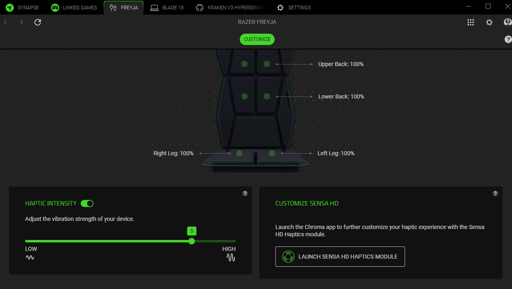
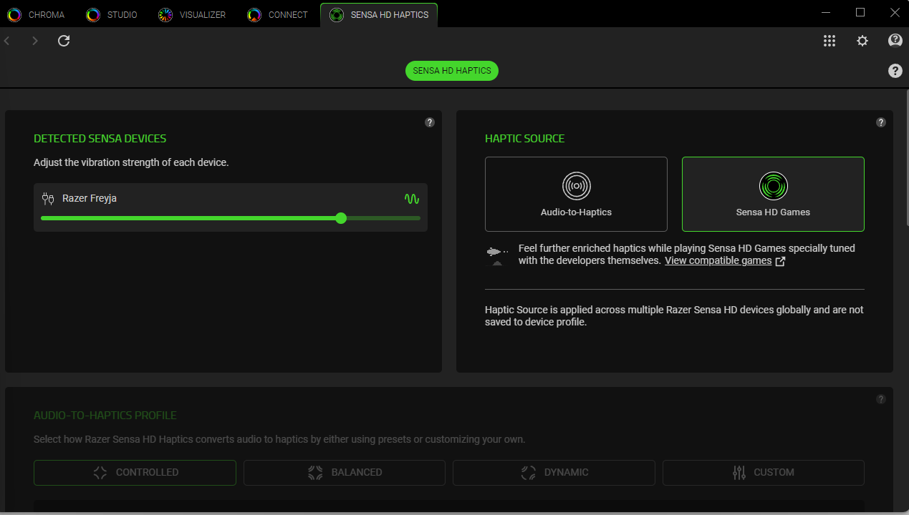
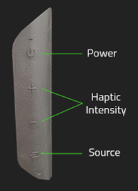
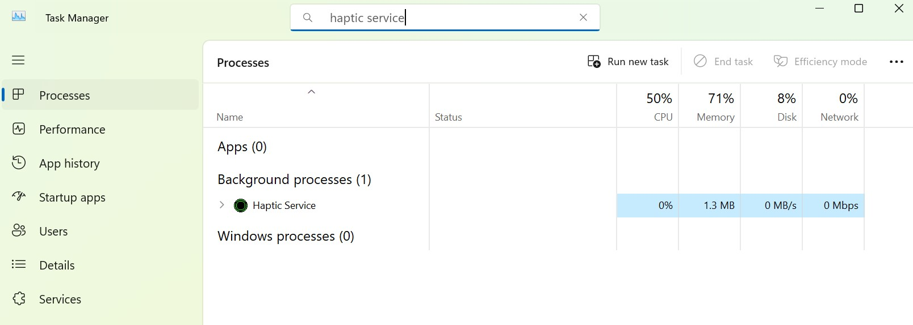
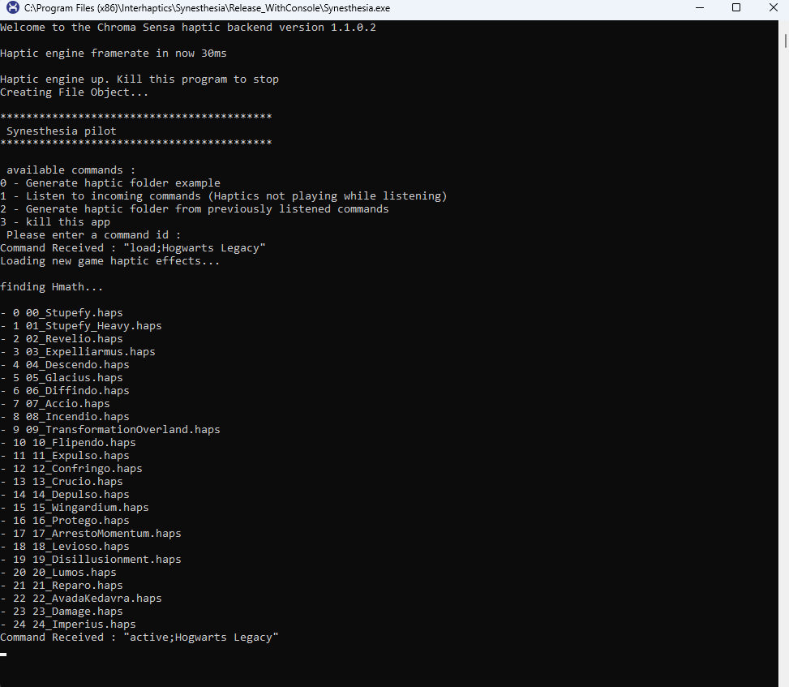
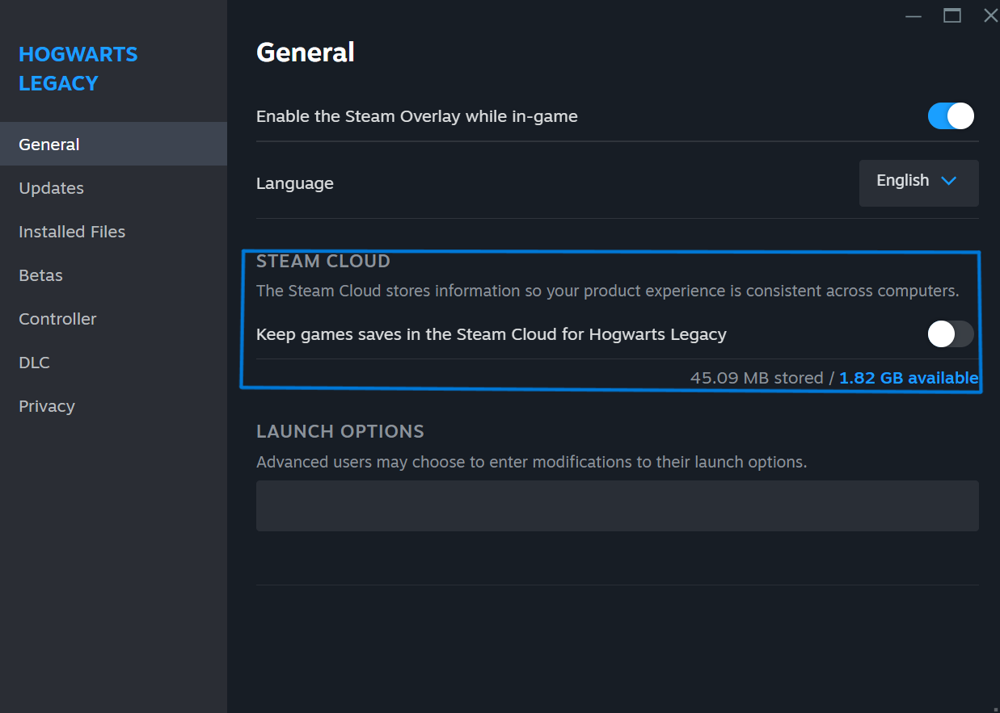
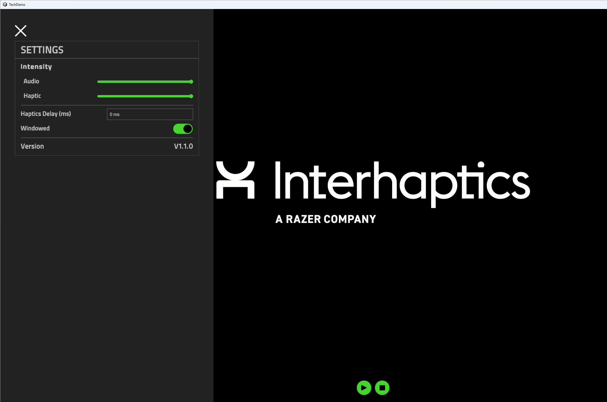

# Razer Sensa DevKit

## 目录
- [Razer Sensa DevKit](#razer-sensa-devkit)
  - [目录](#目录)
  - [1. 驱动程序更新 ](#1-驱动程序更新-)
    - [1.1. Razer Synapse 4 安装（位置：Drivers\\Kraken）](#11-razer-synapse-4-安装位置driverskraken)
    - [1.2. Razer Freyja 安装 ](#12-razer-freyja-安装-)
    - [1.3. Razer Wolverine V3 Pro 安装 ](#13-razer-wolverine-v3-pro-安装-)
  - [2. 应用程序 ](#2-应用程序-)
    - [2.1 Synesthesia 应用（位置：Synesthesia）](#21-synesthesia-应用位置synesthesia)
    - [2.2. 技术演示（位置：TechDemo）](#22-技术演示位置techdemo)

---

Razer Sensa 开发套件由以下硬件设备与软件组件组成：
- 硬件：
  - Razer Kraken v4 Pro（开发套件设备——无基座）
  - Razer Freyja 触觉坐垫（零售版）
  - Razer Wolverine V3 Pro 控制器（零售版）[视库存情况而定]
  - Razer Chroma RGB 设备（键盘、鼠标、鼠标垫）[视库存情况而定]
- 驱动/固件：
  - Razer Synapse 4
- 演示：
  - 《霍格沃茨之遗》PC 版本
  - 技术演示（Tech Demo）

## 1. 驱动程序更新 

### 1.1. Razer Synapse 4 安装 （位置：Drivers\\Kraken）

- 通过 Synapse 可执行文件启动 Razer Synapse 4 安装程序（位置：`Drivers\\Synapse\\Synapse 4`）。也可从此链接下载最新版： https://www.razer.com/synapse-4
- 在安装过程中勾选 Chroma 选项。
- 安装完成后，使用 Razer ID 登录或创建一个账号开始使用（或以访客身份登录）。
- 如果需要重启，请重新启动电脑。
- 打开 Razer Synapse 4。进入 Razer Freyja/Wolverine V3 Pro 或 Kraken V4 Pro 标签页，点击 Launch Sensa HD Haptics 按钮。检查 Haptic Source 是否为 Sensa HD Games。如果显示为 Audio-to-Haptics，请切换为 Sensa HD Games。

### 1.2. Razer Freyja 安装 

#### 如何设置 Razer Freyja

- 将电源插头插入插座，并将电源线连接到 Razer Freyja 触觉坐垫。
- 按下电源按钮开启 Freyja。
- 将 USB 接收器插入电脑。
- 指示灯为绿色常亮表示连接成功。

#### 按钮功能

- **Power：** 开/关设备。
- **Haptic Intensity：** 选择设备的整体触觉强度，范围从 1（低）到 6（高）。
- **Source：** 在 USB 接收器（绿色）与蓝牙（蓝色，当前阶段不支持）之间切换。
- **重要提示：** 如果灯光为绿色闪烁，请尝试将 USB 接收器插入其他端口。若灯光为蓝色（闪烁或常亮），表示设备处于蓝牙模式，请按 Source 按钮切换为 USB 2.4 接收器连接。

### 1.3. Razer Wolverine V3 Pro 安装 

#### Razer Wolverine V3 Pro 固件更新（v2.02 或更高）

- 通过以下链接下载 Razer Wolverine V3 Pro 固件更新工具： https://mysupport.razer.com/app/answers/detail/a_id/14630/~/razer-wolverine-v3-pro-firmware-updater-%7C-rz06-0520
- 按照上述链接中的说明更新 Razer Wolverine V3 Pro 手柄固件。

#### 如何设置 Razer Wolverine V3 Pro

- 将 USB 接收器或 USB 数据线连接至电脑。
- 按下 Xbox 按钮开启手柄。
- 同时按住 o + Menu + A 键 2 秒以进入 PC 模式。注意：Sensa HD Haptics 仅在 PC 模式下支持，Xbox 模式不支持。

## 2. 应用程序 

### 2.1 Synesthesia 应用 （位置：Synesthesia）

##### 2.1.1 概述

Synesthesia 引擎将支持 WYVRN 的游戏与多种 Razer Chroma RGB 与 Sensa 触觉设备集成，实现基于游戏内事件的动态触觉反馈。开发套件包含《霍格沃茨之遗》的触觉集成示例。完整文档见： [https://doc.wyvrn.com/docs/wyvrn-sdk/wyvrn-configuration/haptics/](https://doc.wyvrn.com/docs/wyvrn-sdk/wyvrn-configuration/haptics/)

Synesthesia 应用位于 `ReleaseConsole` 文件夹。控制台版本用于测试与 QA。HapticFolders 也位于 Synesthesia 应用目录下的 `HapticFolders`，当已安装 Razer Chroma 时，该文件夹的最新版本可在 `C:\\Program Files (x86)\\Interhaptics\\HapticFolders` 找到。

如需使用控制台版本替代生产版本（生产版本随 Synapse/Chroma 4 以 HapticService 后台服务形式提供），请按以下步骤操作：
- 打开 Razer Synapse 4。在 Razer Freyja/Kraken V4 Pro 标签页点击 Launch Sensa HD Haptics 按钮。检查 Haptic Source 是否为 Sensa HD Games**；若为 Audio-to-Haptics，请切换为 Sensa HD Games。

- 打开任务管理器，检查 Haptic Service 后台进程是否在运行，如在运行请将其关闭。

- 打开从 https://github.com/Interhaptics/RazerSensa_DevKit 下载的 Synesthesia 应用，并使用 WYVRNFakeClient 通过启动后显示的命令 `load; active; play` 进行测试。
- 故障排除提示： 如果控制台未接收到应出现的事件，请在控制台中按回车以重启（这会释放未发送事件的缓冲区）。该已知问题仅存在于控制台版本；在 HapticService 组件（非控制台）中不存在。

##### 2.1.2 在 Chroma Sensa 集成游戏中测试触觉（示例：Hogwarts Legacy / Marvel Rivals）

以下说明以《霍格沃茨之遗》为例，但也适用于此链接中的任意游戏：https://www.razer.com/chroma-workshop#--sensa-games（例如：Marvel Rivals、Final Fantasy XVI、Silent Hill 2、Sniper Elite: Resistance、Frostpunk 2、Symphonia 等）。
- 安装《霍格沃茨之遗》PC 版（Steam/Epic）。
- 插入 Razer Sensa 触觉设备。
- 确认《霍格沃茨之遗》/Marvel Rivals 已启用为 Chroma App。
- 打开 Razer Synapse 4。进入 Razer Freyja/Kraken V4 Pro 标签页并点击 Launch Sensa HD Haptics 按钮。检查 Haptic Source 是否为 Sensa HD Games；若为 Audio-to-Haptics，请切换为 Sensa HD Games。

- 启动《霍格沃茨之遗》或 Marvel Rivals。

*如需查看触觉效果的实际播放，或添加自定义触觉文件夹（例如在 QA 过程中），可仅按 2.1.1 步骤操作。之后将自定义触觉文件夹复制到 Synesthesia 应用的 `HapticFolders` 内并启动游戏——下图展示了《霍格沃茨之遗》在游戏过程中于 Synesthesia 控制台应用中的调用示例。

**触觉已在所有游戏事件中实现。如果你尚未游玩《霍格沃茨之遗》，可按以下快速指南导入该存档：
- 从你的 Steam/Epic 账户启动游戏。出现霍格沃茨录取通知书画面后退出游戏。
- 在 Steam 中右键《霍格沃茨之遗》并禁用云存档功能。

- 在文件资源管理器中前往 `C:\\Users\\<Your USERNAME>\\AppData\\Local\\Hogwarts Legacy\\Saved\\SaveGames`
- 复制此位置下的所有文件夹（通常以数字命名）作为备份。
- 删除原文件夹内容。将 `HogwartsLegacySaveGame.zip` 解压到该空文件夹中。

### 2.2. 技术演示 （位置：TechDemo）
- 关闭 Synesthesia Console。
- 将 `TechDemo_V[x.x.x].zip` 解压到任意文件夹。
- 从解压后的文件夹中启动 TechDemo 应用。
- 点击 Play 并体验 Razer Sensa Tech Demo。

[返回目录](#table-of-contents)
